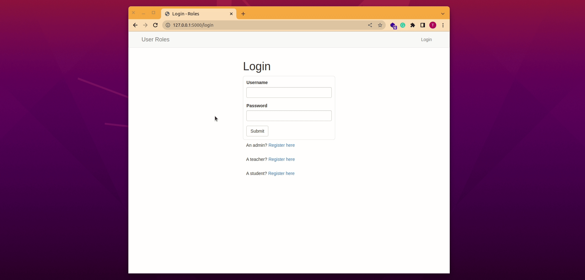

# Implementing Custom User Roles in Flask


This project is a small test run to implement a custom functionality to accurately identify a user of the application. The need to do this arose from multiple failures to get user authentication right in a number of applications I was building.

#### Table of Contents

- [Background](#background)
- [Project Overview](#project-overview)
- [Testing the Application Locally](#testing-the-application-locally)


## Background

Flask offers robust ways to authenticate users of an application. It is very straight forward. One can build amazing projects very quickly due to this feature. All you need to do is to create a database for your users, called "User", and populate it.

The excitement of being able to do this made me try to create a passion project called [Somasoma Elearning App](https://github.com/GitauHarrison/somasoma-eLearning-app). The application, as the name suggests, is an elearning platform. I wanted this app to feature three independent users: admin, teacher and student. 

My initial attempt was to create three models: Admin model, Teacher model and Student model defining some common data I wanted to store and some that were specific to a particular user.

The first challenge came when I needed to help the application to identify and load a user. Normally, this can be done as follows:

```python
@login.user_loader
def load_user(id):
    return User.query.get(int(id))
```

What this does is to tell flask login to load a user based on their ID from the User model. Unfortunately, this could not work with my application. I had three models. How would I load each user independently?

### Attempt 1

The first thought was to do this:

```python
@login.user_loader
def load_user(id):
    admin = Admin.query.get(int(id))
    teacher = Teacher.query.get(int(id))
    student = Student.query.get(int(id))
    return admin or student or teacher
```

Makes sense, right? All the users from their models are returned. 

I quickly learnt that even though this solves my 'loading' problem, the biggest setback came when a user wanted to log themselves out. Picture this: 

>When any user, the admin, the teacher, or the student logs into their account, the application unilaterally loads all the users, even though only a student may be the one interested in doing so. At the time of logging out, the student will do so well, but then the other two users, the admin and the teacher, will still be logged in. Pages that feature `if current_user.is_athenticated` will still consider that there are other users currently logged in to the application.

This was not the most ideal way of handling different application users.

### Attempt 2

The frustrations from **attempt 1** forced me to check the SQLAlchemy documentation for a way around this. I learnt of the concept of _joined table inheritance_. It was exactly what I was looking for. I even wrote a whole [article](https://github.com/GitauHarrison/notes/blob/master/databases/99_joined_table_inheritance.md) about this life-saving concept. The idea behind joined table inheritance is this:

>- If the models have some common colums, say username, email and password, it is best to create a model called User that define these columns.
>- Then, create additonal models that define the specific columns in each model. For example, a Teacher table will have the 'course' column whereas the Student mmodel will have a model-specific column called 'school'.
>- The User model with common columns act as the base class from which the Teacher, Student, and Admin models will inherit.
>- The tables are configured using mappers and identified using a discriminator column


To demonstrate how joined table inheritance works, I created a project called [implementing joined table inheritance in flask](https://github.com/GitauHarrison/implementing-joined-table-inheritance-in-flask). To my utter surprise, I came to an insurmountable obstacle I hadn't envisioned. 

Let us think about this for a moment:

- User registration is normally handled using a register view function. 
  ```python
  @app.route('/register', methods=['GET', 'POST'])
  def register():
    form = RegistrationForm()
    if form.validate_on_submit():
        user = User(
            username=form.username.data,
            email=form.email.data,
        )
        db.session.add(user)
        db.session.commit()
        flash('User successfully registered')
        return redirect(url_for('login'))
    return render_template('register.html', title='Register')
  ```

The problem with this view function as far as joined table inheritance is concerned goes is that the user is added to the "User" model only. What about the other model specific data, such as 'course' for a teacher or 'school' for a student? How do you add them to their models? Should you do this?

```python
  @app.route('/register', methods=['GET', 'POST'])
  def register():
    form = RegistrationForm()
    if form.validate_on_submit():
        user = User(username=form.username.data, email=form.email.data)
        teacher = Teacher(course=form.course.data) # < ----------------------- update
        # ...
    return render_template('register.html', title='Register')
```

The problem with this is that the "User" model will have email and username data but lack course data, while the "Teacher" model will have course data but lack username and email data. This was not the desired outcome.

I came to the conclusion that the concept of joined table inheritance is only theoretically possible. It is almost impractical to create an application whose database design is inspired by it.


### Attempt 3

At last, I arrived to this attempt after someone suggested I try out a few of this packages: [flask principle](https://pythonhosted.org/Flask-Principal/#granular-resource-protection), [flask security](https://pythonhosted.org/Flask-Security/index.html) and [flask user](https://flask-user.readthedocs.io/en/latest/quickstart.html). It was also suggested that I could even implement my own custom logic to work with multiple users.

What all these ideas communicate is that Admin, Teacher and Student are all users. Why not use only one model called "User" then define roles for each user? I decided to follow the custom logic suggestion because I felt I could easily handle that. Basically, I will have only one model called user that defines all the columns I want. Some of these columns may not apply to each user, but that is fine. I can work with `None` or `Null` values here.

See [models.py module](app/models.py) for more information. I will then create view functions as you can see in the [routes module](app/routes.py) which help to populate respective database models. Of importance here is the additional role data I am adding in the view functions:

```python
# app/routes.py

@app.route('/register/admin', methods=['GET', 'POST'])
def register_admin(): 
    # ...   
    form = AdminRegistrationForm()
    if form.validate_on_submit():
        user = User(
            username=form.username.data,
            email=form.email.data,
            residence=form.residence.data,
            role='admin' # < ----------------- custom role
        )
       # ...
    return render_template('register_admin.html', title='Admin Registration', form=form)
```

In select templates, I will limit the display of data based on the role of a signed in user.

```html
<!-- app/templates/user_admin -->




<div class="row">
    <div class="col-md-12">
        
            <h1>Admin</h1>
            <p>Username: {{ current_user.username }}</p>
            <p>Role: {{ current_user.role }}</p>
        
            <p>
                You are not allowed to access this page. 
                <a href=" {{ url_for('logout') }} ">Log out immediately</a>.
            </p>
                
    </div> 
</div>

```

This page will be accessible by any logged in user but the content will not be available for view. Instead, a link to logout is presented to a non-admin user.

This solves my problem. And it is what I decided to use to complete my passion project [Somasoma Elearning App](https://github.com/GitauHarrison/somasoma-eLearning-app).

## Project Overview

The application features three users:

- Admin
- Teacher
- Student

Each of these users can access all pages but only view content specific to them only. A teacher, for example, can only view the teachers' page content. This user cannot view the student or the admin pages contents. If the user attempts to paste the url http://localhost:5000/dashboad/student while logged in as "teacher", the application will tell them they do not have permission to access the said page and it will offer them a link to logout directly.




## Testing the Application Locally

1. Clone this repository
    ```python
    git clonegit@github.com:GitauHarrison/user-roles-in-flask.git
    ```

2. Navigate into the cloned repository

    ```python
    cd user-roles-in-flask
    ```

3. Create and activate a virtual environment:

    ```python
    mkvirtualenv venv # I am using virtualenvwrapper
    ```

4. Create a `.env` file as seen in the `.env-template` file:

    ```python
    cp .env-template .env
    ```

5. Update your SECRET_KEY in `.env` file:

    ```python
    (venv)$ python3 -c 'import secrets; print(secrets.token_hex(16))'

    # Sample output
    99bb842c3bf2231bf0e3070f4f504220
    ```

6. Run the application:

    ```python
    (venv) flask run
    ```

7. Access the application on your favourite browser at http://127.0.0.1:5000/